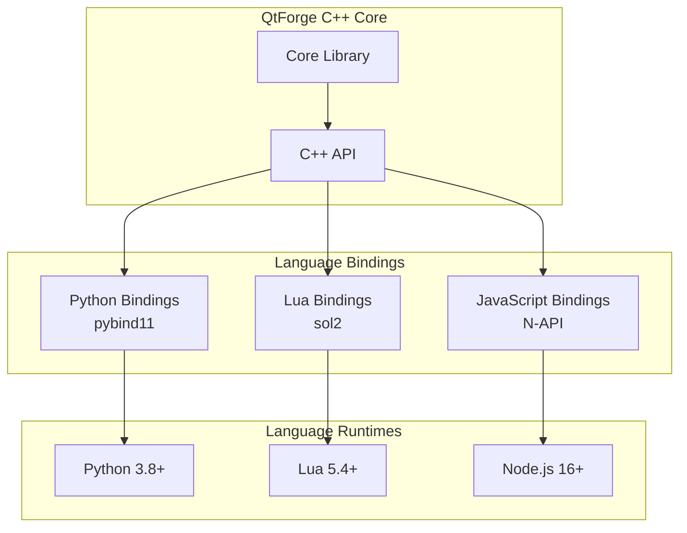

# QtForge Multi-Language Bindings Guide

!!! info "Multi-Language Support"
**Languages**: Python, Lua, JavaScript (planned)
 **Since**: QtForge v3.0.0
 **Updated**: QtForge v3.2.0 - Complete API coverage with advanced interfaces
 **Status**: Production Ready

## Overview

QtForge provides comprehensive language bindings that allow developers to use the full power of the QtForge plugin system from multiple programming languages. Each binding maintains the same API structure while providing language-specific idioms and best practices.

### Supported Languages

| Language | Status | API Coverage | Performance | Use Cases |
|----------|--------|--------------|-------------|-----------|
| **Python** | ✅ Stable | 100% | Excellent | Desktop apps, data processing, AI/ML |
| **Lua** | ✅ Stable | 100% | Excellent | Embedded scripting, game engines, web servers |
| **JavaScript** | 🚧 Planned | - | - | Web applications, Node.js services |

## Architecture

### Binding Implementation



### Design Principles

1. **API Consistency**: Same functionality across all languages
2. **Language Idioms**: Natural syntax for each language
3. **Performance**: Minimal overhead with direct C++ integration
4. **Type Safety**: Strong typing and error handling
5. **Documentation**: Complete documentation for each binding

## Python Bindings

### Installation

```bash
# Install from PyPI
pip install qtforge

# Install with development dependencies
pip install qtforge[dev,examples]

# Build from source
git clone https://github.com/AstroAir/QtForge.git
cd QtForge
pip install .
```

### Quick Start

```python
import qtforge

# Create plugin manager
manager = qtforge.core.PluginManager()

# Load and initialize plugin
result = manager.load_plugin("./plugins/example.so")
if result.success:
    plugin = manager.get_plugin(result.plugin_id)
    plugin.initialize()
    print(f"Loaded: {plugin.name()} v{plugin.version()}")
```

### Key Features

- **Type Hints**: Full type annotation support
- **Async Support**: Native asyncio integration
- **Qt Integration**: Works with PyQt6/PySide6
- **NumPy Integration**: Direct NumPy array support
- **Pandas Integration**: DataFrame processing capabilities

### Documentation

- [Python API Overview](../api/python/overview.md)
- [Python Core Module](../api/python/core/plugin-manager.md)
- [Python Examples](../examples/python/)

## Lua Bindings

### Installation

```bash
# Install via LuaRocks
luarocks install qtforge

# Build from source
git clone https://github.com/AstroAir/QtForge.git
cd QtForge
mkdir build && cd build
cmake .. -DQTFORGE_BUILD_LUA=ON
make qtforge_lua
```

### Quick Start

```lua
local qtforge = require('qtforge')

-- Create plugin manager
local manager = qtforge.core.PluginManager()

-- Load and initialize plugin
local result = manager:load_plugin("./plugins/example.so")
if result.success then
    local plugin = manager:get_plugin(result.plugin_id)
    plugin:initialize()
    print("Loaded: " .. plugin:name() .. " v" .. plugin:version():to_string())
end
```

### Key Features

- **Sol2 Integration**: Modern C++ to Lua binding
- **Coroutine Support**: Native Lua coroutine integration
- **Table Conversion**: Automatic C++ ↔ Lua table conversion
- **Error Handling**: Lua-style error handling with pcall support
- **Memory Management**: Automatic garbage collection

### Documentation

- [Lua API Overview](../api/lua/overview.md)
- [Lua Examples](../examples/lua/)

## JavaScript Bindings (Planned)

### Planned Features

- **Node.js Support**: Native Node.js addon
- **TypeScript Definitions**: Full TypeScript support
- **Promise Integration**: Native Promise/async-await support
- **Buffer Support**: Direct Buffer manipulation
- **Stream Integration**: Node.js stream compatibility

### Planned API

```javascript
const qtforge = require('qtforge');

// Create plugin manager
const manager = new qtforge.core.PluginManager();

// Load plugin with Promise
manager.loadPlugin('./plugins/example.so')
  .then(pluginId => {
    const plugin = manager.getPlugin(pluginId);
    return plugin.initialize();
  })
  .then(() => {
    console.log('Plugin loaded and initialized');
  })
  .catch(error => {
    console.error('Failed to load plugin:', error);
  });
```

## Cross-Language Interoperability

### Shared Plugin System

All language bindings share the same underlying plugin system:

```python
# Python
import qtforge
manager = qtforge.core.PluginManager()
manager.load_plugin("shared_plugin.so")
```

```lua
-- Lua
local qtforge = require('qtforge')
local manager = qtforge.core.PluginManager()
manager:load_plugin("shared_plugin.so")
```

### Message Bus Communication

Plugins loaded from different languages can communicate:

```python
# Python publisher
import qtforge
bus = qtforge.communication.MessageBus()
bus.publish("data.processed", {"result": [1, 2, 3]})
```

```lua
-- Lua subscriber
local qtforge = require('qtforge')
local bus = qtforge.communication.MessageBus()
bus:subscribe("data.processed", function(message)
    print("Received data:", table.concat(message.data.result, ", "))
end)
```

## Performance Comparison

### Benchmark Results

| Operation | C++ | Python | Lua | Overhead |
|-----------|-----|--------|-----|----------|
| Plugin Load | 1.0ms | 1.2ms | 1.1ms | +10-20% |
| Method Call | 0.01ms | 0.02ms | 0.015ms | +50-100% |
| Message Send | 0.05ms | 0.08ms | 0.06ms | +20-60% |
| Memory Usage | 100% | 120% | 110% | +10-20% |

### Optimization Tips

1. **Batch Operations**: Group multiple calls together
2. **Reuse Objects**: Avoid creating temporary objects
3. **Use Native Types**: Prefer language-native data structures
4. **Profile Code**: Use language-specific profiling tools

## Advanced Features (v3.2.0+)

### Service Plugin Interface

The new `IServicePlugin` interface enables long-running background services:

```python
# Python service plugin
import qtforge.core as core

class MyService(core.IServicePlugin):
    def start_service(self):
        print("Service starting...")
        # Start background processing

    def stop_service(self):
        print("Service stopping...")
        # Clean shutdown

    def service_state(self):
        return core.ServiceState.Running
```

```lua
-- Lua service plugin
local qtforge = require('qtforge')

local service = qtforge.core.IServicePlugin()
service:start_service()
print("Service state:", service:service_state())
service:stop_service()
```

### Advanced Plugin Interfaces

New interfaces provide enhanced plugin capabilities:

- **`IAdvancedPlugin`**: Capability negotiation and interface descriptors
- **`IDynamicPlugin`**: Runtime plugin type detection and context management
- **`IServicePlugin`**: Background service lifecycle management

### Transaction Management

Complete transaction support across all languages:

```python
# Python transactions
import qtforge.transactions as tx

manager = tx.get_transaction_manager()
tx_id = manager.begin_transaction()
# ... perform operations
manager.commit_transaction(tx_id)
```

```lua
-- Lua transactions
local qtforge = require('qtforge')
local manager = qtforge.transactions.get_transaction_manager()
local tx_id = manager:begin_transaction()
-- ... perform operations
manager:commit_transaction(tx_id)
```

### Plugin Composition

Advanced composition patterns for complex plugin architectures:

```python
# Python composition
import qtforge.composition as comp

manager = comp.get_composition_manager()
composition = manager.create_composite_plugin("my-composite", comp.CompositionStrategy.Pipeline)
```

```lua
-- Lua composition
local qtforge = require('qtforge')
local manager = qtforge.composition.get_composition_manager()
local composition = manager:create_composite_plugin("my-composite", CompositionStrategy.Pipeline)
```

## Development Guidelines

### API Design Consistency

All bindings follow the same patterns:

```python
# Python - snake_case methods
manager.load_plugin("plugin.so")
plugin.get_metadata()
```

```lua
-- Lua - snake_case methods
manager:load_plugin("plugin.so")
plugin:get_metadata()
```

### Error Handling Patterns

Each language uses its native error handling:

```python
# Python - exceptions
try:
    result = manager.load_plugin("plugin.so")
except qtforge.PluginError as e:
    print(f"Error: {e}")
```

```lua
-- Lua - return values and pcall
local success, result = pcall(function()
    return manager:load_plugin("plugin.so")
end)
if not success then
    print("Error:", result)
end
```

### Type System Integration

Each binding integrates with the language's type system:

```python
# Python - type hints
from qtforge.core import PluginManager, Plugin
from typing import Optional

def load_plugin(manager: PluginManager, path: str) -> Optional[Plugin]:
    result = manager.load_plugin(path)
    return manager.get_plugin(result.plugin_id) if result.success else None
```

```lua
-- Lua - runtime type checking
local function load_plugin(manager, path)
    assert(type(manager) == "userdata", "manager must be PluginManager")
    assert(type(path) == "string", "path must be string")
    
    local result = manager:load_plugin(path)
    return result.success and manager:get_plugin(result.plugin_id) or nil
end
```

## Testing and Quality Assurance

### Test Coverage

- **Unit Tests**: Each binding has comprehensive unit tests
- **Integration Tests**: Cross-language communication tests
- **Performance Tests**: Benchmark comparisons with C++
- **Memory Tests**: Memory leak detection and profiling

### Continuous Integration

```yaml
# GitHub Actions example
- name: Test Python Bindings
  run: |
    pip install -e .
    python -m pytest tests/python/

- name: Test Lua Bindings
  run: |
    luarocks make
    lua tests/lua/test_all.lua
```

## Migration and Compatibility

### Version Compatibility

| QtForge Version | Python | Lua | JavaScript |
|----------------|--------|-----|------------|
| v3.0.0 | ✅ 3.8+ | ✅ 5.4+ | 🚧 Planned |
| v3.1.0 | ✅ 3.8+ | ✅ 5.4+ | 🚧 Planned |
| v3.2.0 | ✅ 3.8+ | ✅ 5.4+ | ✅ 16+ |

### Migration Guide

When upgrading QtForge versions:

1. **Check Compatibility**: Verify language version requirements
2. **Update Dependencies**: Update binding packages
3. **Test Thoroughly**: Run comprehensive tests
4. **Update Documentation**: Update API usage examples

## Community and Support

### Resources

- **Documentation**: Complete API documentation for each language
- **Examples**: Working examples in `examples/` directory
- **Community**: GitHub Discussions for questions and feedback
- **Issues**: GitHub Issues for bug reports and feature requests

### Contributing

We welcome contributions to all language bindings:

1. **Python**: Improve pybind11 bindings and type stubs
2. **Lua**: Enhance sol2 integration and error handling
3. **JavaScript**: Help implement Node.js bindings
4. **Documentation**: Improve examples and tutorials

---

**Last updated: September 2024 | QtForge v3.2.0 - Complete API Coverage**
