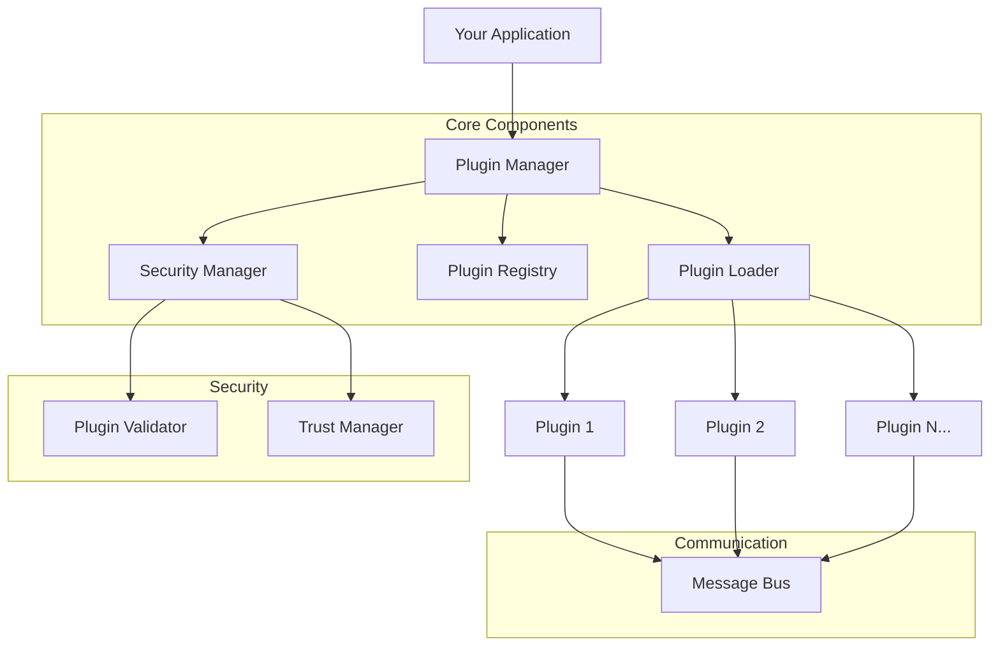

# Getting Started with QtPlugin

Welcome to QtPlugin! This guide will help you understand what QtPlugin is, why you should use it, and how to get started quickly.

## What is QtPlugin?

QtPlugin is a **modern, enterprise-grade C++ plugin system** designed specifically for Qt applications. It provides a robust, type-safe, and performant way to add extensibility to your applications through dynamic plugin loading.

### Key Characteristics

- **🚀 Pure C++**: No QML dependencies, works in any C++ application
- **🔧 Modern Standards**: Built with C++20 features (concepts, coroutines, `std::expected`)
- **🛡️ Type Safe**: Compile-time validation and runtime safety
- **📦 Minimal Dependencies**: Core library only requires Qt6::Core
- **🏗️ Modular**: Optional components for network, UI, and security
- **⚡ High Performance**: Optimized for speed and memory efficiency

## Why Choose QtPlugin?

### 🎯 For Application Developers

- **Easy Integration**: Simple API that integrates seamlessly with Qt applications
- **Flexible Architecture**: Support for various plugin types (services, UI components, processors)
- **Hot Reloading**: Update plugins without restarting your application
- **Security**: Built-in validation and sandboxing capabilities

### 🛠️ For Plugin Developers

- **Clear Interface**: Well-defined plugin interface with comprehensive documentation
- **Modern C++**: Use latest C++ features and best practices
- **Rich Ecosystem**: Access to Qt's extensive library ecosystem
- **Development Tools**: CMake helpers and development utilities

### 🏢 For Enterprise

- **Production Ready**: Thoroughly tested with 100% test coverage
- **Security First**: Multi-layer security with configurable trust levels
- **Performance**: Optimized for high-throughput scenarios
- **Support**: Comprehensive documentation and community support

## Architecture Overview

## Core Concepts

### Plugin Interface

All plugins implement the `qtplugin::IPlugin` interface, which provides:

- **Lifecycle Management**: Initialize, shutdown, and state management
- **Metadata**: Plugin information and capabilities
- **Command Execution**: Execute plugin-specific commands
- **Configuration**: Dynamic configuration management

### Plugin Manager

The central component that handles:

- **Loading/Unloading**: Dynamic plugin lifecycle management
- **Discovery**: Automatic plugin discovery and registration
- **Communication**: Inter-plugin message routing
- **Security**: Validation and trust management

### Message Bus

Enables communication between plugins:

- **Type-Safe Messaging**: Strongly-typed message system
- **Asynchronous Communication**: Non-blocking message passing
- **Event Broadcasting**: Publish-subscribe pattern support
- **Request-Response**: Synchronous communication when needed

## System Requirements

### Minimum Requirements

- **Operating System**: Windows 10+, Linux (Ubuntu 20.04+), macOS 10.15+
- **Qt Version**: Qt 6.0 or later
- **Compiler**: C++20 compatible compiler
  - GCC 10+ (Linux)
  - Clang 12+ (macOS/Linux)
  - MSVC 2019+ (Windows)
- **CMake**: 3.21 or later

### Recommended Setup

- **Qt Version**: Qt 6.5+ for best compatibility
- **Build System**: Ninja for faster builds
- **IDE**: Qt Creator, Visual Studio, or CLion
- **Memory**: 4GB+ RAM for development
- **Storage**: 2GB+ free space for build artifacts

## Component Overview

### Core Components (Always Available)

| Component              | Description                    | Dependencies |
| ---------------------- | ------------------------------ | ------------ |
| **QtPlugin::Core**     | Essential plugin management    | Qt6::Core    |
| **QtPlugin::Security** | Plugin validation and security | Qt6::Core    |

### Optional Components

| Component             | Description               | Dependencies |
| --------------------- | ------------------------- | ------------ |
| **QtPlugin::Network** | Network plugin interfaces | Qt6::Network |
| **QtPlugin::UI**      | UI plugin interfaces      | Qt6::Widgets |

## Next Steps

Now that you understand the basics, let's get QtPlugin installed and running:

1. **[Installation](installation.md)** - Install QtPlugin on your system
2. **[Quick Start](quick-start.md)** - Create your first QtPlugin application
3. **[First Plugin](first-plugin.md)** - Build your first plugin

## Learning Path

### 🎯 Beginner Path

1. [Installation](installation.md) - Get QtPlugin installed
2. [Quick Start](quick-start.md) - Basic usage example
3. [First Plugin](first-plugin.md) - Create your first plugin
4. [Examples](../examples/index.md) - Explore working examples

### 🚀 Intermediate Path

5. [Plugin Development](../developer-guide/plugin-development.md) - Comprehensive plugin creation
6. [API Reference](../api/index.md) - Detailed API documentation
7. [Advanced Patterns](../developer-guide/advanced-patterns.md) - Advanced techniques

### 🏆 Advanced Path

8. [Architecture](../architecture/system-design.md) - System design deep dive
9. [Contributing](../contributing/index.md) - Contribute to the project
10. [Best Practices](../developer-guide/best-practices.md) - Production guidelines

## Getting Help

- **📖 Documentation**: Browse this comprehensive documentation
- **💡 Examples**: Check out the [examples directory](../examples/index.md)
- **🐛 Issues**: Report bugs on [GitHub Issues](https://github.com/QtForge/QtPlugin/issues)
- **💬 Discussions**: Ask questions on [GitHub Discussions](https://github.com/QtForge/QtPlugin/discussions)

Ready to install QtPlugin? Let's move on to the [Installation Guide](installation.md)!
